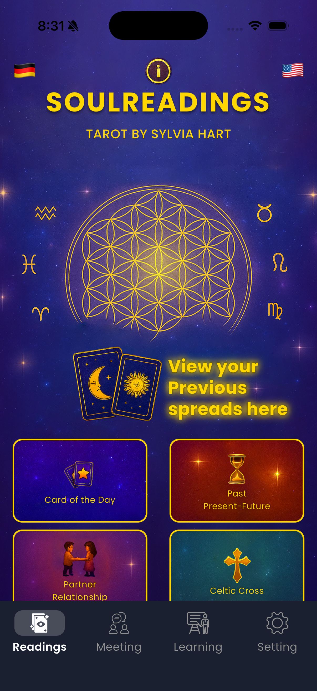
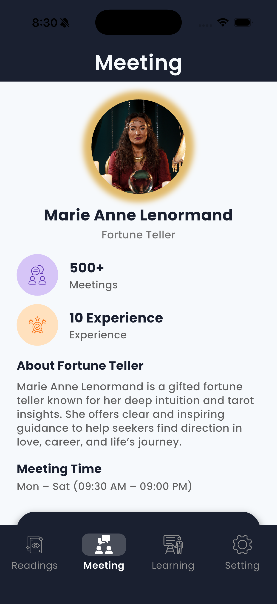
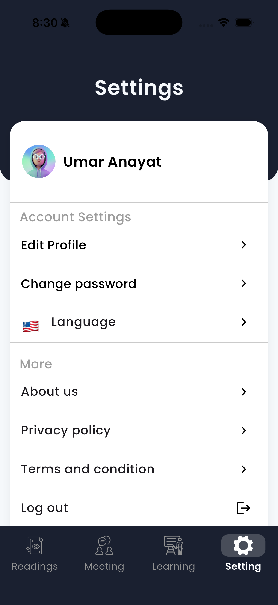

 

# Soul Readings

### Cosmic readings with a booking flow that converts

A reading companion designed with atmosphere and intention.  
Spreads, card focus, saved sessions, and reader appointments — in English and German, wrapped in a dark celestial visual language.

 

  

&nbsp;

 

---

 

### The Idea

> Mystery deserves craft.  
> Soul Readings pairs atmosphere with appointments that actually book.

**Soul Readings** is a focused reading product. It brings spreads, card focus, saved sessions, and reader appointments into one calm, celestial experience — designed in English and German, with a visual language that feels intentional and premium.

 

### What It Delivers

- **Mood Set** — Immersive splash
- **The Draw** — Spreads and single-card focus
- **Memory** — Previous spreads kept close
- **Book the Reader** — Appointment scheduling
- **You** — Editable profile
- **Trust Pages** — About, privacy, terms
- **Two Languages** — English and German
- **Brandable Mystique** — Ready for your reading brand

 

### Interface

  
  &nbsp;&nbsp;
  
  &nbsp;&nbsp;
  

  Designed for atmosphere and conversion — premium UI captures

 

---

 

### Work With The Developer

**Umar Anayat** designs and ships Flutter products that feel intentional.  
Calm motion. Sharp UI. Features people actually use.

Looking to customize, white-label, or adapt this project to your brand?

 

&nbsp;

 

 
